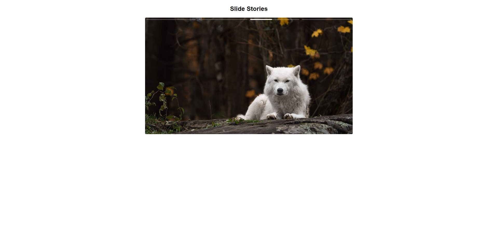
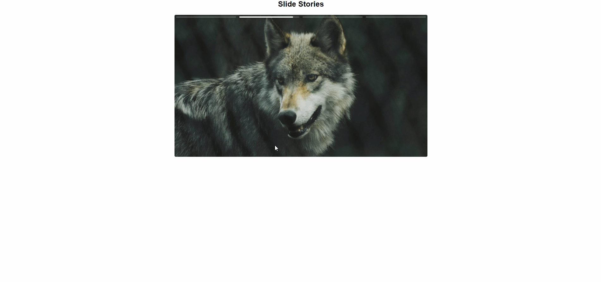

<h1>Dados </h1>

<!-- LINKS -->

 
 <h2> Sumário</h2>
 
 <a href="#fotos">Fotos</a> - 
  <a href="#sobre">Sobre o Projeto</a> -
  <a href="#tec">Tecnologias</a>

 

<!-- FOTOS -->

    <h2> 📸 Fotos </h2>
        
          
        
          

<!-- SOBRE -->

    <h2> 📝 Sobre o Projeto </h2> 
    
 Projeto feito para lidar com a requisição de dados de uma API. Durante o projeto, foram criados tipos e interfaces, houve a normalização das chaves da API, conversão de string para data e diversas outras funcionalidades envolvendo o uso do TypeScript.

     <h3 align="center">Link do Projeto <a href="https://lucasfrancobn.github.io/Stories/index.html">CLIQUE AQUI</a></h3>

 

<!-- TECNOLOGIAS -->

<h2> 🖥️ Tecnologias</h2>
    
 ✔️ TypeScript 

    
 ✔️ Vite 

